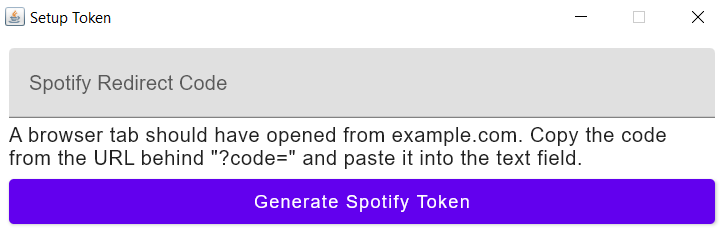
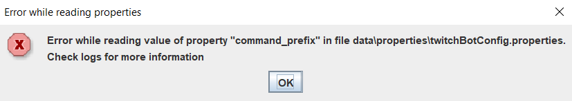

# Spotify Bot
Spotify Bot for everyone to use. The main functionality is to have users add songs to the queue (via redeem or command). Additional functionality can be found below or be requested.<br>
Though the Bot is free to use, consider giving credit on your twitch via command or panel.<br>
Created by [alexshadowolex](https://www.twitch.tv/alexshadowolex)

Table of Contents:
1. [Current Versions](#current-versions)
2. [How to set up](#how-to-set-up)
   1. [Requirements](#requirements)
   2. [Setup Steps](#setup-steps)
      1. [Download and save](#download-and-save)
      2. [Set Up Project Structure](#set-up-project-structure)
      3. [Update Properties](#update-properties)
      4. [Set Up Spotify Token](#set-up-spotify-token)
3. [How to Update](#how-to-update)
4. [Current functionalities](#current-functionalities)
5. [Contents of data-files explained](#contents-of-data-files-explained)
6. [Additional Information](#additional-information)

## Current Versions
* Spotify-Bot.jar: v2.0.4 [Download from Release v2.0.4](https://github.com/alexshadowolex/Spotify-Bot/releases/download/v2.0.4/Spotify.Bot-windows-x64-2.0.4.jar)
* SetupToken.jar: v4 [Download from Release v2.0.0](https://github.com/alexshadowolex/Spotify-Bot/releases/download/v2.0.0/SetupToken_v4.jar)
* SetupProject.jar: v2 [Download from Release v2.0.0](https://github.com/alexshadowolex/Spotify-Bot/releases/download/v2.0.0/SetupProject_v2.jar)
* UpdateProperties.jar: v2.0.3 [Download from Release v2.0.4](https://github.com/alexshadowolex/Spotify-Bot/releases/download/v2.0.4/UpdateProperties_2-0-3.jar)

## How to set up

### Requirements
You need to have java 17 or higher installed on your pc. To check if you have, open a cmd (type "cmd" bottom left into search bar) and type "java --version". If it responds with a version, you will see the version number. If not, you can download java 19 installer from here: [Oracle Java 19](https://download.oracle.com/java/19/archive/jdk-19.0.2_windows-x64_bin.msi).
After installing, check again in a new cmd if it is installed.
<br>
Also the app only works on windows.
<br><br>

### Setup Steps
#### Download and save
Download all files and put them on the same level, like this:
````
-> someFolder
    -> SetupProject.jar
    -> SetupToken.jar
    -> UpdateProperties.jar
    -> Spotify-Bot.jar
````
During the setup process, you will need to execute those jars in a specific order. Execute them from the same location.
<br><br>
#### Set Up Project Structure
First we need to set up the project structure. Execute the newest version of the file SetupProject.jar.<br>
You will see this window:
<br>

<br>
To get the Twitch Token, do following steps:
1) Open your browser and log into the twitch account that the bot is supposed to use.
2) Open a new tab and go to [Token Generator](https://twitchtokengenerator.com/).
3) Click on "Custom Scope Token".
4) Go all the way down beyond the long list of scopes and click on "Select All".
5) Click on the green button "Generate Token!".
6) After the new site loaded, click on "Authorize".
7) Scroll up to the section "Generated Tokens" and copy the access token.
8) Paste the access token into the field "Twitch Token" in the Setup Project window.

<br><br>
Into the field "Twitch Channel", type the twitch channel's name the bot is supposed to be used on. Note that the bot should moderator on that channel.
<br><br>
Both the Spotify ID and Spotify Secret need to get copied from the [Spotify Developer Dashboard](https://developer.spotify.com/dashboard). Login with your spotify credentials and do following steps to get them:<br>
1) Click on "Create App"<br>
2) Give your app a name<br>
3) Write into the field "Redirect URI" the address "https://www.example.com". If you chose a different URI, the setup will not work.<br>
4) Select "Web API". You can also select more, if you want to.<br>
5) Agree to the TOS and click on "Save"<br>
6) Go to "Settings". There you see the client ID. After clicking on "View Client Secret", you also see the secret. Copy both of them into the given field.<br>

<br>
Now Click in SetupProject on "Setup Project". After a success message, you can close this window.

Now the data-folder should exist with following structure:
````
-> data
    -> properties
        -> botConfig.properties
        -> spotifyConfig.properties
        -> twitchBotconfig.properties
    -> tokens
        -> twitchtoken.txt
        -> spotifyClientSecret.txt
````
<br><br>
#### Update Properties
Now we need to fill the files with the needed properties. For that, execute the UpdateProperties.jar of the newest project version.
After doing that, a cmd will open and log the added properties:<br>

<br>
The properties-files in folder data\properties now have the needed entries. They only have default values at the moment.
<br>
You can change the properties' values later in the UI. If you are interested in what property has which functionality, you can check the detailed explanation of the properties under [Contents of data-files explained](#contents-of-data-files-explained).<br>
<br><br>
#### Set Up Spotify Token
Now we need to set up the Spotify token. Execute the latest version of SetupToken.jar. Two things will happen: A Browser Tab opens and following window will be visible:<br>

<br>
Go into the browser tab. It has the website of the redirect URI open, example.com. In the URL, you will see following text:<br>

<br>
Copy everything after "?code=" and paste it into the text field. Click now on "Generate Spotify Token". Close the window after the success message.
<br>
Now you will find "spotifyToken.json" in data\tokens\. 
<br><br><br>

With this, the setup is done. You can execute the Spotify-Bot.jar with the current version on the same level as all the other files. The data folder needs to be next to it.<br>
On start up, the bot will display a message in chat to confirm start up. <br>

## How to Update
If an update is released, you can find it under [Releases](https://github.com/alexshadowolex/spotify-bot/releases). In every release you can find a changelog for big changes and some attached files.
<br>
If the release includes a file "UpdateProperties_<version>.jar" it means that new properties have been added during the release. Download this file and execute it first so all needed properties are there. The cmd will inform you, which properties in which files are new.
<br>
If the release includes new versions of the other script files (SetupProject, SetupToken), they are the latest versions. Older version might not work anymore. Download, if needed.
<br>
The file, that will always be included, is the new Bot version. Download it and swap out the old version with the new one.

## Current functionalities
* Follower only mode -> Can be toggled off (switch in UI under "General Settings").
  You can set the minimum following time in minutes needed to use commands in a field in the UI under Twitch Settings.
* Song Request -> Can be toggled off (switch in UI under "General Settings"). Either with redeem or chat command.<br>
  Command names: "songrequest", "sr"<br>
  Takes a spotify-link or a text and then adds the result to the queue.<br><br>
  You can set the maximum length of song duration in the UI under Spotify Settings.<br><br>
  You can block songs by adding their direct link (share link) to the list "Blocked Song Links" in the UI under Spotify Settings.<br><br>
  You can block artists by adding their name to the list Blocked Song Artists in the UI under Spotify Settings.
* Song Name Getter -> Can be toggled off (switch in UI under "General Settings"). Gets the current song name, artists and album image and writes it into different files:
  * data\displayFiles\currentSong.txt -> Song Name + "by" + Artists + 10 spaces (thought for moving text display)
  * data\displayFiles\currentSongName.txt -> Song Name
  * data\displayFiles\currentSongArtists.txt -> Song Artists
  * data\displayFiles\currentAlbumImage.jpg -> Current song album's image
  <br><br>
  The different files are thought so every user can use the parts they want to use.
  <br>
  There is a functionality to empty those files on pause (Empty Song Display Files On Pause switch in UI under "General Settings").
  <br>
  This functionality will only happen, if the function is active and the bot has been started.
* Update Checker -> Can be toggled off (switch in UI under "General Settings"). Checks for new versions on GitHub and if there is one, a window will appear.
* Song Info Command -> Can be toggled off (switch in UI under "General Settings").<br>
  Command names: "songinfo", "si"<br>
  Command to display the current song in twitch chat together with a spotify link.
* Add Song Command -> Can be toggled off (switch in UI under "General Settings").<br>
  Command names: "addsong", "as", "add"<br>
  Command to add the current song to a certain playlist. This playlist is identified by an ID set in the UI under "Spotify Settings" with the field Playlist ID For Add Song Command. <br>
  To obtain this ID, simply extract it from the share-link: <br>
  E.g. the ID in this share link: https://open.spotify.com/playlist/idinsidethislink?si=abc1234569ada is "idinsidethislink", the random characters between "playlist/" and "?si". Just crop it out and paste it into the fitting field.<br>
  This functionality can be restricted to be used only by certain user groups:
  * BROADCASTER: Only the broadcaster
  * MODERATOR: Owner and Moderators
  * CUSTOM: Custom group of users, specified per username in list Custom Group Usernames For Add Song Command under General Settings.<br>
* Skip Song Command -> Can be toggled off (switch in UI under "General Settings").<br>
  Command names: "skipsong", "skip", "next", "ss"<br>
  Command to skip the current song.<br>
  This functionality can be restricted to be used only by certain user groups:
    * BROADCASTER: Only the broadcaster
    * MODERATOR: Owner and Moderators
    * CUSTOM: Custom group of users, specified per username in list Custom Group Usernames For Skip Song Command under General Settings.<br>
* Remove Song From Queue Command -> Can be toggled off (switch in UI under "General Settings").<br>
  Command names: "removesongfromqueue", "rsfq", "remove", "removesong", "rs"<br>
  Command to remove a song from the queue.<br>
  To use this command, type the song name and artists and the bot searches for the most similar song in the queue. To achieve best results use the song name string that the bot responds with after a song request (or when you use the song info command), e.g. ""Ghost" by Confetti"<br>
  This functionality can be restricted to be used only by certain user groups:
  * BROADCASTER: Only the broadcaster
  * MODERATOR: Owner and Moderators
  * CUSTOM: Custom group of users, specified per username in list Custom Group Usernames Remove Song From Queue Command under General Settings.<br>
* Block Song Command -> Can be toggled off (switch in UI under "General Settings").<br>
  Command names: "blocksong", "block", "bs"<br>
  Command to block the current song and skip it.<br>
  This functionality can be restricted to be used only by certain user groups:
  * BROADCASTER: Only the broadcaster
  * MODERATOR: Owner and Moderators
  * CUSTOM: Custom group of users, specified per username in list Custom Group Usernames For Block Song Command under General Settings.<br>

## Contents of data-files explained
The files consist of following content:
````
data\tokens\twitchtoken.txt: only the twitch token, nothing else
````
````
data\tokens\spotifyClientSecret.txt: only the spotify client secret from the app, nothing else
````
````
data\properties\botConfig.properties:
    ->isSongRequestCommandEnabled=<true or false. If this is false, the redeem will be enabled on app start instead>
    ->blacklistedUsers=<list of Twitch names/IDs of users that can't use the redeem/command, seperated by ",">
    ->isSpotifySongNameGetterEnabled=<true or false. If this is true, the name getter functionality is enabled>
    ->isNewVersionCheckEnabled=<true or false. If this is true, the bot checks for a new version on GitHub and if there is one, it will open a window>
    ->isSongRequestEnabled=<true or false. If this is true, the song request functionality is enabled>
    ->isSongInfoCommandEnabled=<true or false. If this is true, the song info command is enabled>
    ->isEmptySongDisplayFilesOnPauseEnabled=<true or false. If this is true, the song display files emptying on pause functionality is enabled>
    ->isAddSongCommandEnabled=<true or false. If this is true, the add song command is enabled>
    ->addSongCommandSecurityLevel=<security level that decides, who can use the add song command. Possible values: BROADCASTER, MODERATOR, CUSTOM>
    ->isSkipSongCommandEnabled=<true or false. If this is true, the skip song command is enabled>
    ->isRemoveSongFromQueueCommandEnabled=<true or false. If this is true, the remove song from queue command is enabled>
    ->skipSongCommandSecurityLevel=<security level that decides, who can use the skip song command. Possible values: BROADCASTER, MODERATOR, CUSTOM>
    ->customGroupUserNamesAddSongCommand=<custom group of users for the add song command, when "CUSTOM" is selected. List of usernames, seperated by ",">
    ->customGroupUserNamesSkipSongCommand=<custom group of users for the skip song command, when "CUSTOM" is selected. List of usernames, seperated by ",">
    ->removeSongFromQueueCommandSecurityLevel=<security level that decides, who can use the remove song from queue command. Possible values: BROADCASTER, MODERATOR, CUSTOM>
    ->customGroupUserNamesRemoveSongFromQueueCommand=<custom group of users for the remove song from queue command, when "CUSTOM" is selected. List of usernames, seperated by ",">
    ->isBlockSongCommandEnabled=<true or false. If this is true, the block song command is enabled>
    ->blockSongCommandSecurityLevel=<security level that decides, who can use the block song command. Possible values: BROADCASTER, MODERATOR, CUSTOM>
    ->customGroupUserNamesBlockSongCommand=<custom group of users for the block song command, when "CUSTOM" is selected. List of usernames, seperated by ",">
    ->isFollowerOnlyModeEnabled=<true or false. If this is true, the follower only mode is enabled>
````
````
data\properties\twitchBotConfig.properties:
    ->channel=<Twitch channel Name>
    ->commandPrefix=<prefix for command usage>
    ->defaultCommandCoolDownSeconds=<cool down in seconds for commands>
    ->defaultUserCoolDownSeconds=<cool down in seconds for users per command>
    ->songRequestRedeemId=<the ID of the song request redeem>
    ->songRequestEmotes=<Twitch emotes that will be used after confirmation of an added song, seperated by ",">
    ->blacklistMessage=<Message will be displayed after a blacklisted user tried using a command/redeem>
    ->minimumFollowingDurationMinutes=<Minimum following duration for follower only mode. This value is interpreted as Minutes (you can also use decimal numbers). If you don't want a minimum following duration, you can sett it to 0.>
````
````
data\properties\spotifyConfig.properties:
    ->spotifyClientId=<client ID from spotify app>
    ->playlistIdForAddSongCommand=<playlist ID for add song command. Check the command description for how to obtain the ID>
    ->maximumLengthSongRequestMinutes=<Maximum song length for songrequests. This value is interpreted as Minutes (you can also use decimal numbers). If you don't want a maximum lenght limit, just leave this property empty.>
    ->blockedSongLinks=<Spotify direct links of songs that are blocked and will not be added to the queue, seperated by ",">
    ->blockedSongArtists=<Names of artists that are blocked and their songs will not be added to the queue, seperated by ",">
````
<br>
Following properties are not changeable in the UI:

* spotifyClientId in spotifyConfig.properties
* channel in twitchBotConfig.properties

If you need to change them you need to do that directly inside the properties files and restart the bot.
<br><br>
If you don't have the redeem ID, you have 2 possible solutions:<br>
1.) Use the redeem's name instead (on the property songRequestRedeemId). Start the bot and use the redeem once. Then go into the latest log-file and check for a warning that says you used the name and should use the ID instead. Copy and Paste it and done.<br>
2.) Go to https://www.instafluff.tv/TwitchCustomRewardID/?channel=channel_name (swap out channel_name with your channel). Then use the redeem on your channel, the site will show you the redeem ID.


## Additional Information
* Use any compiled binary (.jar-files) at your own risk. They could be doing anything without you knowing it. Either you trust me and my builds or not. I will take no responsibility for anything.
* If you change the properties' values directly in the properties files while the bot is running, they will not be applied until next start up and might even be overwritten.
* It is not recommended to overwrite properties directly in the properties files since almost all of them can be changed in the UI. But feel free to go wild! 
* Make sure to check on releases, if there are newer version of the project-setup- or setup-token-jar, if needed.
* If an error occurred (a window with an error message appeared), read the error message. The most common mistake is a property missing or having invalid data. A property missing can be identified like this: <br>
  
  <br>
  Here you can see the name of the faulty property and the file it is located in.
* If any issues occurred, message me on Discord (alexshadowolex) or on [Twitch](https://twitch.tv/alexshadowolex). Please also provide the log files and tell me, what went wrong.
* Also feel free to message me for any improvement ideas.
